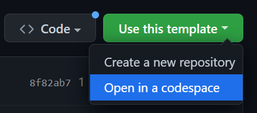

# Website Template
This is a starting template for a simple website frontend using HTML, CSS, and JS only. 

## How to Use
Create a new repository using this template by navigating to the [Github page](https://github.com/athsiao/website-template) and selecting **"Use this template"** as shown in the image below.

Simply select **"Create a new repository"** on your own account, and edit to your liking.
